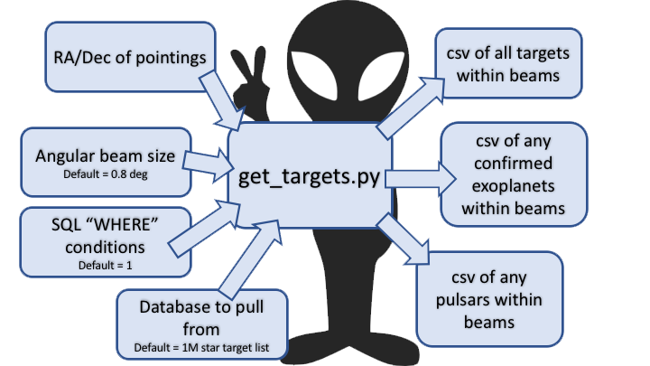

## get_targets.py
Script for generating list of all objects in the 1M star target list which fall within a primary beam, given a list of RA/Dec pointings and selection parameters.
test.txt and test2.txt contain sample RA/Dec pointings which can be used to test out the script.

Schematic of how get_targets.py functions.
